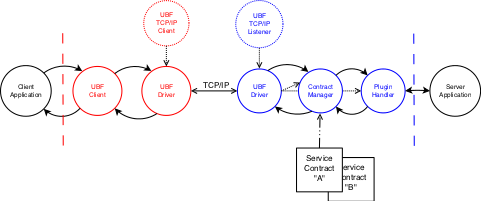

#Module ubf_driver#
* [Description](#description)
* [Function Index](#index)
* [Function Details](#functions)

Protocol driver process for UBF(A) protocol sessions.

__Behaviours:__ [`contract_driver`](contract_driver.md).

##Description##

The process executing `loop()` in this module is represented in the
diagram below by the "UBF Driver" circle.

##Function Index##

<table width="100%" border="1" cellspacing="0" cellpadding="2" summary="function index"><tr><td valign="top"><a href="#decode-5">decode/5</a></td><td></td></tr><tr><td valign="top"><a href="#encode-3">encode/3</a></td><td></td></tr><tr><td valign="top"><a href="#init-1">init/1</a></td><td></td></tr><tr><td valign="top"><a href="#init-2">init/2</a></td><td></td></tr><tr><td valign="top"><a href="#start-1">start/1</a></td><td></td></tr><tr><td valign="top"><a href="#start-2">start/2</a></td><td></td></tr></table>

##Function Details##

###decode/5##

`decode(Contract, Safe, Cont, Binary, CallBack) -> any()`

###encode/3##

`encode(Contract, Safe, Term) -> any()`

###init/1##

`init(Contract) -> any()`

###init/2##

`init(Contract, Options) -> any()`

###start/1##

`start(Contract) -> any()`

###start/2##

`start(Contract, Options) -> any()`

